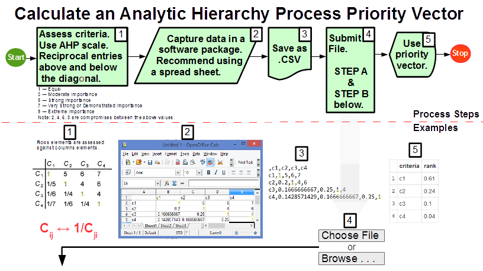

## Purpose   

To calculate an analytic hierarchy process (AHP) priority vector with its inconsistency ratios.

## Scope
* In scope: 
  + Input: a square pairwise comparison matrix in the form of a delimited text file accessible to the user's local computer. 
  + Process: a R Shiny application using an AHP function from the pmr package.
  + Output: an AHP priority vector with Saaty and Koczkodaj inconsistency ratios to the screen.
   
* Out of scope: 
  + Anything not using a CSV pairwise comparison matrix text file as an input with an output a computed priority vector with inconsistency ratios to the screen using a R Shiny application. The number of simulations for inconsistency ratios are also not considered.    

---  

## The Fundamental Scale for Pairwise Comparisons   
* In an AHP matrix, the row entry is compared to the column entry.  
* Each pair is compared twice: once above and below the diagonal with reciprocal values.  
* As in the example below, the element A1 in the first row has a strong importance, 5,  over element A2 in the second column.  Also, row A2 element is 1/5 the value of the A1 element. 
 The fundamental scale is as follows:     


Value   |     Definition  
------- | ------------------  
**1**   | Equal importance  
**3**   | Moderate importance  
**5**   | Strong importance  
**7**   | Very strong or demonstrated importance  
**9**   | Extreme importance  

Note: 2, 4, 6, and 8 are for compromises between the above values.

---

## Process Steps with Examples     
   
Result is the following priority vector; please compare with Process #5 example output above:  
```{r echo=FALSE, message=FALSE, warning=FALSE}
# Compute the actual examle matrix
library(pmr)
## create example artificial matrix in the info graph on the slide
abc <- matrix(data = 1:16, nrow = 4, ncol = 4, byrow = TRUE)
abc[1,1] <- 1
abc[1,2] <- 5
abc[1,3] <- 6
abc[1,4] <- 7
abc[2,1] <- 1/5
abc[2,2] <- 1
abc[2,3] <- 4
abc[2,4] <- 6
abc[3,1] <- 1/6
abc[3,2] <- 1/4
abc[3,3] <- 1
abc[3,4] <- 4
abc[4,1] <- 1/7
abc[4,2] <- 1/6
abc[4,3] <- 1/4
abc[4,4] <- 1

## compute the weights, Saaty's and Koczkodaj's inconsistencies
A <- ahp(abc)
## present only the weighting vector for comparison with the picture
round(A$weighting,2)

```
  

---

## Results of the AHP Shiny App    
  


